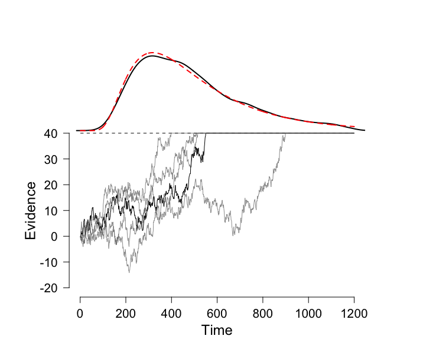

```{r setup, include=FALSE}
knitr::opts_chunk$set(echo = FALSE)
# define a function that outputs a drift diffusion process
gendat = function(ndat = 1000, alpha=40, drift=0.1, dt = 0.1) {
  dat <- array()
  dat[1] <- 0
  for (j in 1:(ndat - 1)) {
    if (dat[j]<alpha){
      dat[j+1] <- min(dat[j] + drift * dt + rnorm(n=1, mean=0, sd=1), alpha) 
    }
    else {
      dat[j+1] <- alpha
    }
  }
  invisible(dat)  # same as 'return', but without printing to console    
}

## General settings:
dt <- 1
drift <- 0.08
alpha <- 40
ntime <- 1200
times <- c(1:ntime)

# Plot settings:
ylow <- -20
yhigh <- alpha
xhigh <- ntime
greycol <- rgb(red = 100, green = 100, blue = 100, alpha = 170, maxColorValue = 255)
# For transparent lines set, set 'alpha' between 0 (invisible) and 255 (opaque)

# define Wald distribution
SW <- function(x,gamma,alpha,theta){
  y <- alpha/sqrt(2*pi*(x-theta)^3)*exp(-1*(alpha-gamma*(x-theta))^2/(2*(x-theta)))
  return(y)
}

```

## Architecture of arithmetic

Ashcraft (1992) - stages of mental arithmetic

<center>

</center>

## Architecture of arithmetic

Fundamental question: how are stages inter-related?

<center>

</center>

## Architecture of arithmetic

Additive model (McCloskey, 1992; Dehaene, 1992): each stage independent from others

<center>

</center>

## Architecture of arithmetic

Interactive model (Campbell, 1994; Campbell & Epp, 2004): manipulations of encoding directly affect calculation

<center>

</center>

## Evidence for additive model?

<center>

</center>


## Evidence for interactive model?

<center>

</center>

## How to test?

Classical method:

1. have people do a bunch of trials -- measure RTs
2. find mean RT for each experimental condition / person
3. test for differences in means (e.g., ANOVA)

This method is **lossy**...it collapses each person's **RT distribution** to a **single number**

## Problems when we lose measurement resolution

<center>

</center>

## RT distributions

```{r}
inputPanel(
  sliderInput("alpha1", label="shape",min=10,max=100,value=40,step=5)
)


renderPlot({
x<-1:1000
gamma <- input$alpha1/300
y<-SW(x,gamma=gamma,alpha=input$alpha1,theta=0)

plot(x, y, type = "l", lwd = 2, main = "", ylab = "", 
     xlab = "", axes = FALSE, ylim = c(0,0.008), xlim = c(0, 1000), cex.lab = 1.2, 
     font.lab = 2, cex.axis = 1.2, col = "black", bty = "n")

abline(v=400,col="red",lty=2,lwd=2)
text(410,0.005,"mean = 400 ms",pos=4,cex=1.5)
axis(1, at = c(0, 200, 400, 600, 800,1000), lab = c("0", "200", "400", "600", "800","1000"))
axis(2)
par(las = 0)
mtext("RT (ms)", side = 1, line = 2.5, cex = 1.5)
mtext("Density", side = 2, line = 2.8, cex = 1.5)
})
```

## RT distributions

Need a *measurement model* that captures important characteristics of RTs...

1. onset
2. central peak
3. tail

## Some mathematical fun

Let's go for a *random walk*, where our steps are determined by the roll of a single die.

Rules:

1.  Start in the center of the room
2.  roll an even number $\rightarrow$ take a step rightward
3.  roll an odd number $\rightarrow$ take a step leftward

Will you ever reach the wall?  How long will it take?

## Random walk model

For a long time, mathematical psychologists have used this basic idea to model the cognitive processes involved in decision tasks


## Random walk with drift
Let $X_0=0$, and for $t\in \mathbb{N}$, define

\[
X_t=X_{t-1}+\gamma +\varepsilon_t
\]

where $\gamma >0$ and $\varepsilon_t \sim \mathcal{N}(0,1)$ for all $t$

Note:

+ $X_j$ is called the *evidence accumulated* at time $j$
+ $\gamma$ (the *drift rate*) is the average rate of accumulation of evidence
+ when $X_j \geq \alpha$ (the *response threshold*), we stop


## Random walk with drift

```{r}
inputPanel(
  sliderInput("drift", label="Drift rate", min=0,max=0.2,value=0.08,step=0.01),
  sliderInput("alpha", label="Response threshold",min=20,max=40,value=40,step=5)
)

renderPlot({
op <- par(cex.main = 1.5, mar = c(5, 6, 4, 5) + 0.1, mgp = c(3.5, 1, 0), cex.lab = 1.5, 
      font.lab = 2, cex.axis = 1.3, bty = "n", las = 1)
plot(times, gendat(ndat = ntime, input$alpha, input$drift, dt), type = "l", lwd = 1, main = "", ylab = "", 
     xlab = "", axes = FALSE, ylim = c(ylow, yhigh), xlim = c(0, xhigh), cex.lab = 1, 
     font.lab = 2, cex.axis = 0.9, col = "black", bty = "n")

axis(1, at = c(0, 200, 400, 600, 800, 1000, 1200), lab = c("0", "200", "400", "600", "800", 
     "1000", "1200"))
axis(2, at = c(-20, -10, 0, 10, 20, 30, 40))
par(las = 0)
mtext("Time", side = 1, line = 2.5, cex = 1.5, at=ntime/2)
mtext("Evidence", side = 2, line = 2.8, cex = 1.5, at=10)
lines(c(1, ntime), c(input$alpha, input$alpha), lwd = 1, lty = 2, col = "black")
})
```


## Random walk with drift

Let's fix a response threshold $\alpha>0$.  Are we guaranteed that the random walk $\{X_i\}$ will "hit" $\alpha$?

Answer: Yes

**Lemma**: Let $\alpha>0$.  Then there exists $t\in\mathbb{N}$ so that $X_t\geq \alpha$.


## Random walk with drift

**Lemma**: Let $\alpha>0$.  Then there exists $t\in\mathbb{N}$ so that $X_t\geq \alpha$.

Proof: First, let's construct an explicit formula for $X_n$.

$$
\begin{align}
X_0 &= 0\\
X_1 &= X_0 + \gamma + \varepsilon_1\\
    &= \gamma + \varepsilon_1\\
X_2 &= X_1 + \gamma + \varepsilon_2\\
    &= (\gamma + \varepsilon_1)+\gamma +\varepsilon_2\\
    &= 2\gamma + \sum_{i=1}^2\varepsilon_i
\end{align}
$$

## Random walk with drift

**Lemma**: Let $\alpha>0$.  Then there exists $t\in\mathbb{N}$ so that $X_t\geq \alpha$.

Proof: First, let's construct an explicit formula for $X_n$.

$$
\begin{align}
X_n    &= n\gamma + \sum_{i=1}^n\varepsilon_i
\end{align}
$$

## Random walk with drift

**Lemma**: Let $\alpha>0$.  Then there exists $t\in\mathbb{N}$ so that $X_t\geq \alpha$.

Proof: Now, by way of contradiction, assume that $X_t<\alpha$ for all $t\in\mathbb{N}$

Then 

$$
\begin{align}
& t\gamma + \sum_{i=1}^t\varepsilon_i < \alpha\\
\implies & \gamma + \frac{1}{t}\sum_{i=1}^t\varepsilon_i < \frac{\alpha}{t}\\
\end{align}
$$

## Random walk with drift

**Lemma**: Let $\alpha>0$.  Then there exists $t\in\mathbb{N}$ so that $X_t\geq \alpha$.

Proof: As $t\rightarrow \infty$, we have

$$
\begin{align}
& \lim_{t\rightarrow \infty}\gamma + \lim_{t\rightarrow\infty}\frac{1}{t}\sum_{i=1}^t\varepsilon_i < \lim_{t\rightarrow\infty}\frac{\alpha}{t}\\
\implies & \gamma < 0
\end{align}
$$
which is a contradiction.

## Distribution of random walks

Let's simulate 10,000 of these random walks and record the time at which the walk "hits" the response boundary.

##
<center>

</center>

## 
<center>

</center>

## Shifted Wald Distribution

$$
f(x \mid \gamma,\alpha,\theta) = \frac{\alpha}{\sqrt{2\pi(x-\theta)^3}}\cdot \exp\Biggl(-\frac{(\alpha-\gamma(x-\theta))^2}{2(x-\theta)}\Biggr)
$$
where

* $\gamma$ = signal accumulation rate (i.e., drift rate)
* $\alpha$ = response threshold
* $\theta$ = time external to signal accumulation 


## Shifted Wald Distribution
```{r}
inputPanel(
  sliderInput("gamma2", label="gamma",min=0.01,max=0.15,value=0.11,step=0.01),
  sliderInput("alpha2", label="alpha",min=10,max=100,value=30,step=5),
  sliderInput("theta2", label="theta",min=0,max=400,value=0,step=50)
)


renderPlot({
x<-1:1000
y<-SW(x,gamma=input$gamma2,alpha=input$alpha2,theta=input$theta2)

plot(x, y, type = "l", lwd = 2, main = "", ylab = "", 
     xlab = "", axes = FALSE, ylim = c(0,0.008), xlim = c(0, 1000), cex.lab = 1.2, 
     font.lab = 2, cex.axis = 1.2, col = "black", bty = "n")

text(410,0.005,paste("mean = ",round(input$alpha2/input$gamma2+input$theta2), "ms"),pos=4,cex=1.5)
axis(1, at = c(0, 200, 400, 600, 800, 1000), lab = c("0", "200", "400", "600", "800", "1000"))
axis(2)
par(las = 0)
mtext("RT (ms)", side = 1, line = 2.5, cex = 1.5)
mtext("Density", side = 2, line = 2.8, cex = 1.5)
})
```

## Application

Let's see how modeling RTs with shifted Wald distributions can help solve problems in the psychology of mental arithmetic

## Mapping Shifted Wald parameters

<center>

</center>

+ drift rate ($\gamma$) $\mapsto$ calculation
+ response threshold ($\alpha$) $\mapsto$ calculation
+ time external to response ($\theta$) $\mapsto$ encoding and production


## Predictions -- additive model

<center>

</center>

+ problem size affects $\gamma$ 
+ problem format affects $\theta$ *only*


## Predictions -- additive model

<center>

</center>

+ problem size affects $\gamma$ 
+ problem format affects $\theta$ and $\gamma$

## Experiment

Arithmetic verification task

+ 20 participants
+ 288 arithmetic verification trials (e.g., 3 + 5 = 7: T/F)
+ manipulations
    + problem size (small, large)
    + problem format (digits, words)
    + truth value (true, false)
    
## Modeling

* Design: 2 (problem size) x 2 (format) x 20 (participants)
* fitted shifted Wald parameters for RT distribution in each design cell

<center>

</center>

## Results 

<center>

</center>

No interaction between problem size and format

* strictly additive model

## Results 

<center>

</center>

Drift rate impacted by **both** problem size and format

## Results 

<center>

</center>

Response threshold impacted only by format

## Results 

<center>

</center>

Nondecision time impacted only by format

## Take home

Interactive model: manipulation of format directly affects calculation (via drift rate)

<center>

</center>

## Questions?

* Thomas J. Faulkenberry, Ph.D.
* Department of Psychological Sciences
* Email: faulkenberry@tarleton.edu
* Twitter: @tomfaulkenberry

